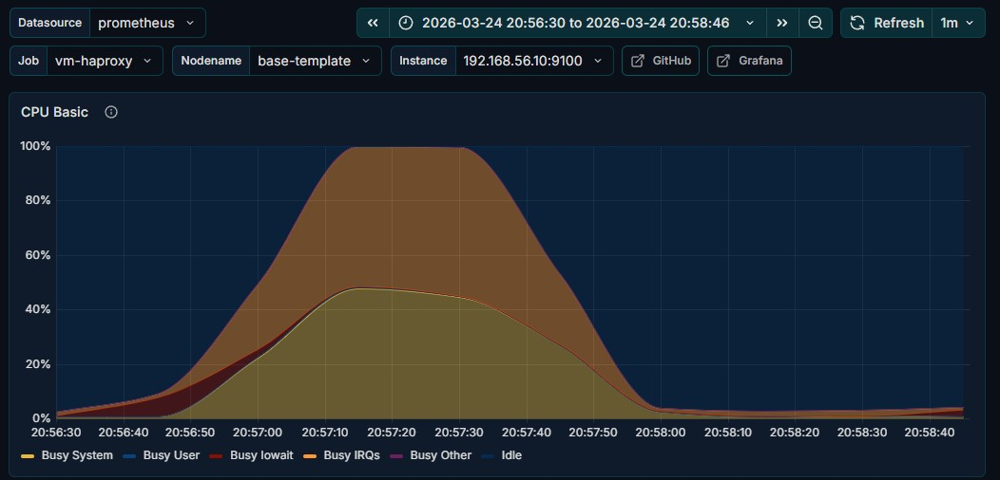
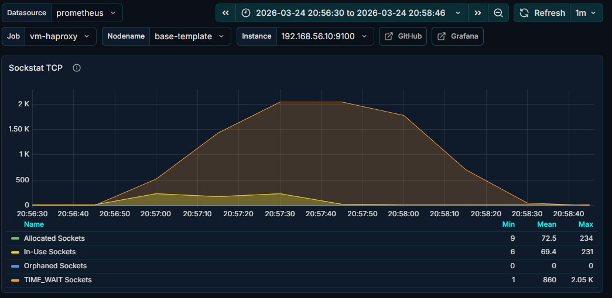
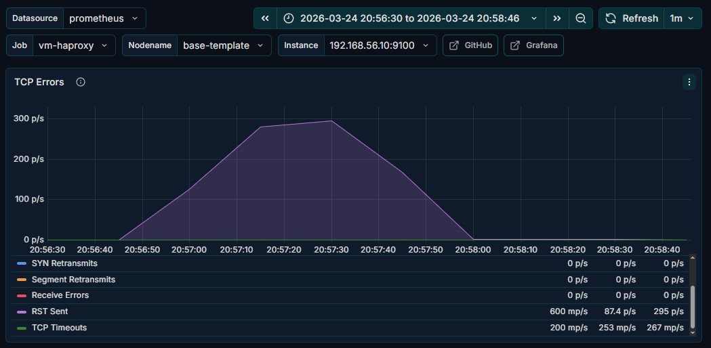
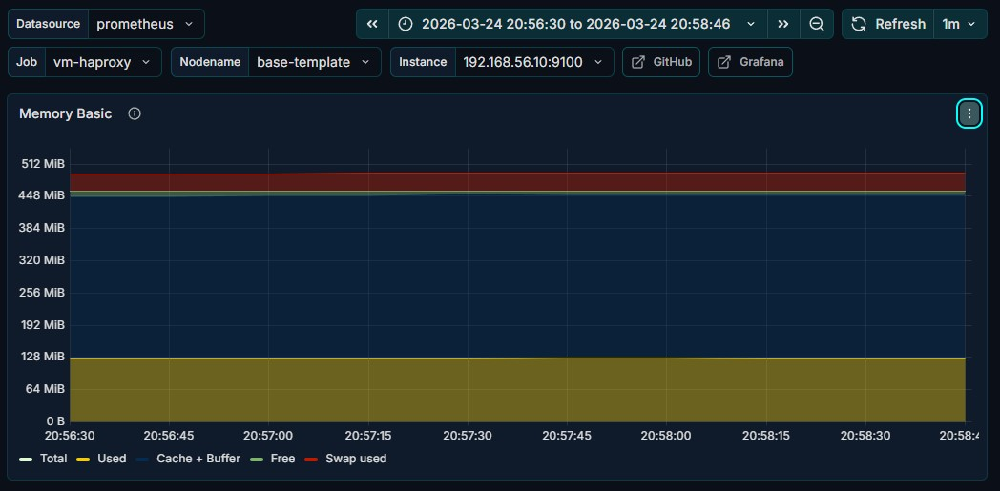
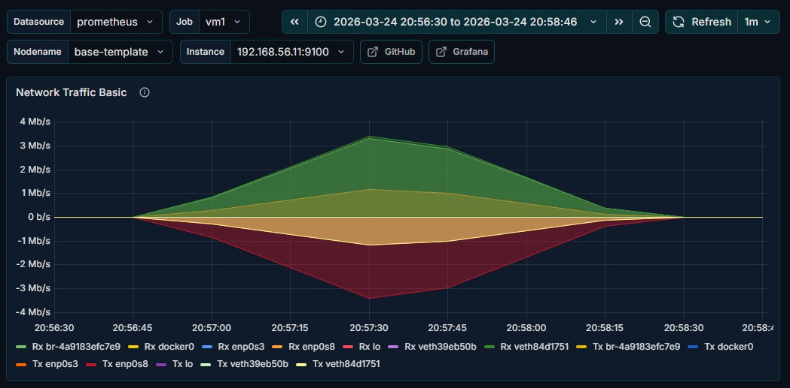
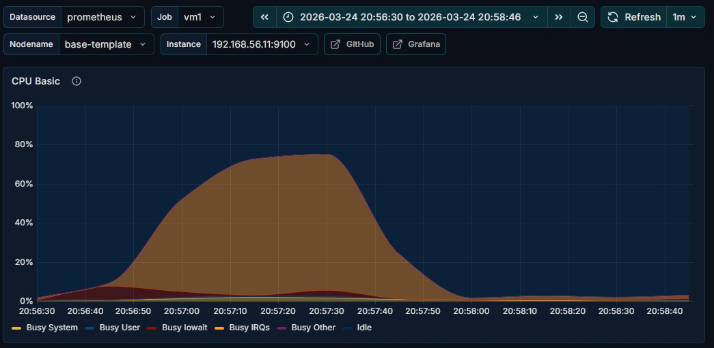
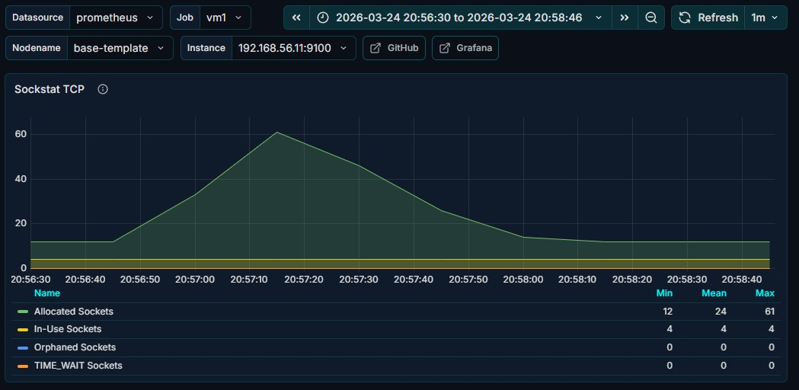
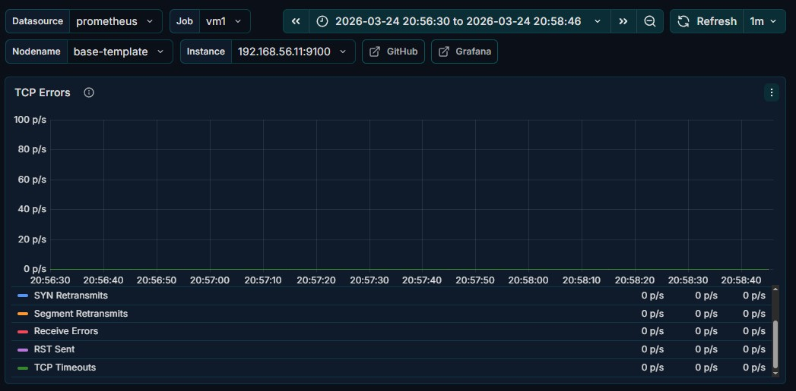

# High-Concurrency HTTP Stress Testing: Analysis of TCP Port Exhaustion and Upstream Bottlenecks in Multi-Tier Infrastructure

## Investigating TCP Stack Limitations: A Case Study on HAProxy Socket Saturation and Nginx Webserver Load Distribution

---

## Project Overview

This project simulates a High-Concurrency workload to identify the Saturation Point of a multi-tier infrastructure. The primary research focus is to analyze how HAProxy manages outbound connection spikes to the web server (Nginx) and to identify system failures caused by TCP Port Exhaustion (TIME_WAIT saturation), even when the Web Server's resources (RAM/CPU) remain sufficient.

---

## Infrastructure Components

### 1. Load Engine (Tester Machine)
- **Technology:** Python 3.10
- **Concurrency:** ThreadPoolExecutor with 500 simultaneously active threads
- **Traffic Volume:** 20,000 HTTP Requests sent to the Nginx Edge Proxy
- **Objective:** Test TCP Handshake efficiency and HAProxy's ability to distribute load via Weighted Round Robin

### 2. Observability & Monitoring Stack
Pull-based monitoring methodology was used to collect accurate data during testing:
- **Node Exporter:** Installed on every VM (1, 2, 3) to expose kernel and hardware-level metrics (CPU, RAM, Network Stack)
- **Prometheus:** Acts as the Time-Series Database, scraping data from Node Exporter every 5 seconds
- **Grafana:** Used for real-time data visualization, enabling correlation analysis between traffic spikes and socket states (such as TIME_WAIT)

### 3. Test Scenario
1. **Baseline:** Recording idle conditions across all VMs
2. **Stress Execution:** Running the Python script with 500 threads targeting the Nginx Edge Proxy
3. **Analysis:** Observing traffic distribution (80% to VM1, 20% to VM3) through HAProxy
4. **Recovery:** Monitoring the duration of socket cleanup by the Linux kernel after traffic stops

---

## Architecture & Topology

```
[  TESTER / CLIENT  ]
( Python-based concurrent request generator (~500 concurrent requests) )
                     |
                     | HTTP Requests (20,000)
                     v
          +-------------------------+
          |    NGINX EDGE PROXY     |  <-- Layer 1: Client Entry Point & Routing/Reverse Proxy
          |      (Port 80)          |
          +----------+--------------+
                     |
                     v
          +-------------------------+
          |      VM-HAPROXY         |  <-- Layer 2: Load Balancer
          |   (Weight 80:20)        |      (Weighted Round Robin)
          +----------+--------------+
                     |
          ___________|___________
         | (80%)                 | (20%)
         v                       v
  +--------------+        +--------------+
  |     VM 1     |        |     VM 3     |
  |  (Nginx WS)  |        |  (Nginx WS)  |  <-- Layer 3: Web Servers
  | [Primary]    |        | [Secondary]  |
  +-------+------+        +-------+------+
          |                       |
          +-----------+-----------+
                      |
                      v
          +-------------------------+
          |          VM 2           |  <-- Layer 4: Shared Database
          |       (Shared DB)       |      (Persistence Layer)
          +-------------------------+

      [  MONITORING STACK  ]
      ( Grafana + Prometheus )
               |
      _________|_________
     |         |         |
     v         v         v
 [ VM 1 ]   [ VM 2 ]   [ VM 3 ]
 (Node Exporter Monitoring Flow)
```

- **Client (Tester):** Python-based concurrent request generator (~500 concurrent requests)
- **Edge Proxy:** Nginx (Gateway & reverse proxy)
- **Load Balancer:** HAProxy (Weighted Round Robin, 80:20)
- **Web Servers:** Nginx (VM1 & VM3)
- **Database:** MySQL (VM2, centralized persistence layer)
- **Monitoring:** Prometheus + Grafana + Node Exporter
- **Virtualization:** VirtualBox on baremetal host

---

## Tech Stack

- **Language:** Python 3.10+ (Threading & Requests library)
- **Load Balancer:** HAProxy
- **Web Server & Reverse Proxy:** Nginx
- **Database:** MySQL
- **Monitoring:** Node Exporter, Prometheus & Grafana
- **Host OS:** Windows
- **VM OS:** Linux Ubuntu

### VM Specifications

| Node | OS | CPU | RAM | Role |
|---|---|---|---|---|
| VM-HAProxy | Ubuntu 22.04 | 1 Core | 512 MB | Load Balancer |
| VM1 | Ubuntu 22.04 | 1 Core | 2 GiB | Web Server (Weight 80) |
| VM3 | Ubuntu 22.04 | 1 Core | 1 GiB | Web Server (Weight 20) |

---

## Test Results

Based on testing with 20,000 requests and 500 threads:

- **Success Rate:** 63.5% (12,695 Requests)
- **Error Rate:** 36.5% (7,305 Requests)
- **Observed RPS:** 290.38 req/sec
  
[Test Results](evidence/logs/test_results.txt)

## Stats Logs
[Stats Before Test](evidence/logs/stats_before.txt)
[Stats While Test](evidence/logs/stats_peak.txt)
[Stats After Test](evidence/logs/stats_after.txt)


---

## Deep Dive Analysis

### VM-HAPROXY

### Forensic Analysis: Ephemeral Port Exhaustion

**Trigger Point: Traffic Spike & CPU**


During the stress test (20:56 - 20:58), when incoming traffic peaked (~4 Mb/s), CPU on VM-HAProxy immediately spiked to 100% (Busy System/User). This proves that HAProxy was working extremely hard processing TCP handshakes from 500 threads.

**Primary Evidence (Ephemeral Port Exhaustion)**


When CPU hit 100%, the number of TIME_WAIT Sockets spiked sharply to **2.05K**. This is direct evidence of Ephemeral Port Exhaustion — HAProxy ran out of port numbers to open new connections to the web servers because old ports were still stuck in TIME_WAIT status.

**Fatal Impact: RST Sent & Timeouts**


When ports were exhausted, the system began sending **RST Sent (600 mp/s)** and experiencing **TCP Timeouts (267 mp/s)**. Because no ports were available, the kernel forcefully rejected new connections (Reset). This is what caused the 502/504 errors on the Python script side.

**Negative Evidence: RAM Was Not the Cause**


Despite 100% CPU and network errors, RAM remained flat and stable at 128 MiB. This confirms that the issue was purely from the Network Stack — memory was not a limiting factor.

**Final Summary**

The core issue was the massive number of connections (500 threads) requiring HAProxy to perform a TCP Three-way Handshake for every single connection. As a result, the cleanup of finished sockets (connection termination) slowed down and the Linux Kernel could not recycle ports fast enough from TIME_WAIT status. This created a domino effect: TIME_WAIT sockets accumulated to 2.05K → new connections were rejected (RST Sent).

**Root Cause Analysis:** CPU was busy in kernel mode (network stack / packet processing) due to massive Context Switching and Interrupt Handling to manage thousands of TCP packets.

---

### VM1

**Network**

VM1 showed a traffic pattern identical to HAProxy (Weight 80%), proving that the Load Balancing mechanism was working correctly before the system eventually collapsed.

**CPU**

The most critical comparison:
- **CPU HAProxy:** Maxed at 100%, dominated by orange/brown color (Busy System/IRQs) — CPU was exhausted handling kernel networking
- **CPU VM1:** Only reached ~70-75%

**Conclusion:** The web server (VM1) still had headroom, but HAProxy was no longer capable of forwarding packets to VM1.

**SOCKSTAT TCP**



- **HAProxy:** TIME_WAIT count spiked drastically to 2.05K — the primary cause of 502/504 errors
- **VM1:** TIME_WAIT remained at 0 or very low (only Allocated Sockets increased slightly to ~60)

Socket exhaustion only occurred on the Load Balancer side. The web server remained clean, proving that the bottleneck was in HAProxy's outbound connection management.

**Final Summary: Underutilization Due to Upstream Bottleneck**

Although VM1 received 80% of the load and its socket status remained controlled, the bottleneck occurred purely at the Load Balancer layer (HAProxy), which failed to manage outbound connections. As a result, VM1 still had available capacity and could have handled significantly more traffic.

---

## Mitigation Strategies

### For HAProxy (Load Balancer Layer)
- **Vertical Scaling:** Add more CPU cores to VM-HAProxy
- **Horizontal Scaling:** Add a second HAProxy instance with Keepalived for High Availability
- **OS Level Hardening (Kernel Tuning):** Optimize `sysctl` parameters to accelerate TIME_WAIT port recycling:
  ```bash
  net.ipv4.tcp_tw_reuse = 1
  net.ipv4.ip_local_port_range = 1024 65535
  net.ipv4.tcp_fin_timeout = 15
  ```
- **Service Level Optimization:** Implement Connection Pooling and Keep-Alive in HAProxy/Nginx to reduce CPU overhead from repetitive TCP handshakes

### For Web Servers (VM1 & VM3)
- **Maximizing Webserver Potential:** The test reveals an utilization imbalance between the Load Balancer (100%) and VM1 (75%). To maximize VM1's potential, mitigation must focus on kernel optimization at the HAProxy level so the data distribution path is not obstructed

---

## How to Reproduce

1. Clone this repository
2. Setup 3 VMs (HAProxy + 2 Web Servers) using VirtualBox Host-Only Network
3. Apply HAProxy & Nginx configurations located in `/configs`
4. Install dependencies:
   ```bash
   pip install requests tqdm
   ```
5. Update the `target_url` in `scripts/stress_test_v1_threading.py` and run:
   ```bash
   python scripts/stress_test_v1_threading.py
   ```

---

*Created by Rizki A Fauzi — 2026*

> This project is for educational and security research purposes only. Do not use these scripts on infrastructure you do not own.
